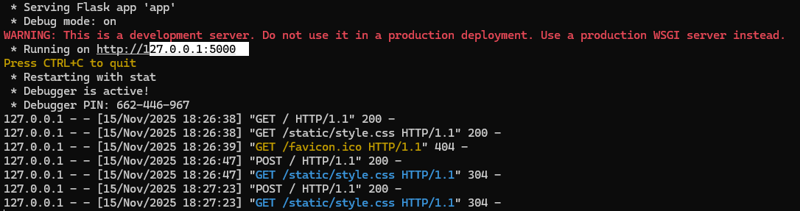
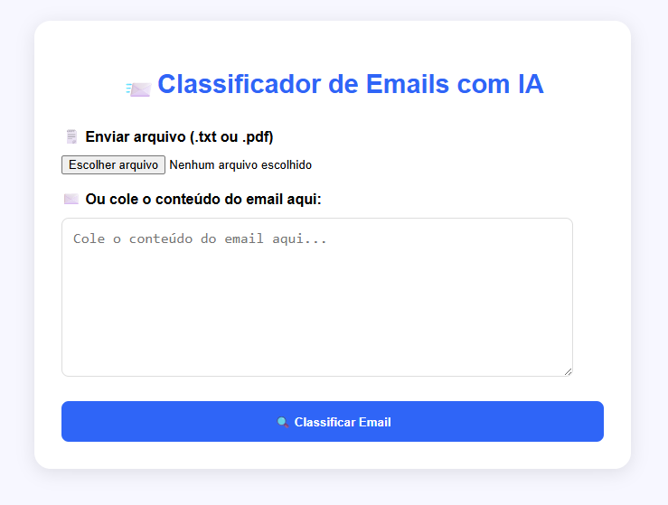
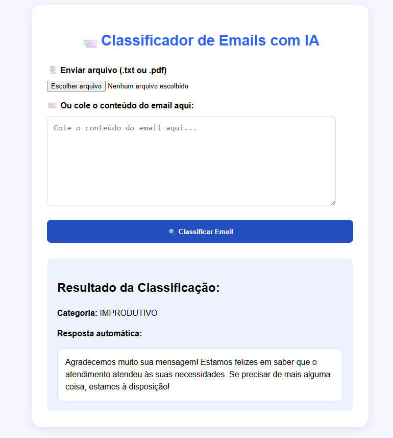
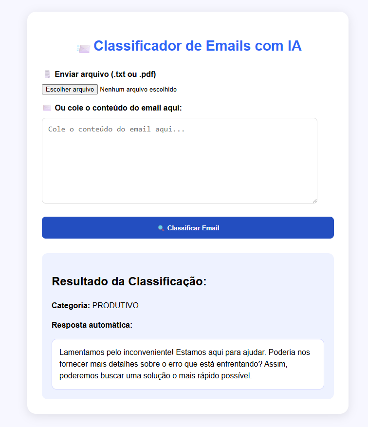

# 🗒️Classificador de Emails com Inteligência Artificial

 O Classificador de Emails com IA foi desenvolvido visando a automação de leitura, classificação e sugestão de respostas automáticas para emails recebidos por grandes empresas, especialmente no setor financeiro. <br>O sistema classifica cada email como PRODUTIVO ou IMPRODUTIVO e gera uma resposta adequada, economizando tempo da equipe que anteriormente teria que lidar manualmente com o grande volume de mensagens recebidas.

---

## 🔍Tecnologias Utilizadas

- **CSS**
- **HTML**
- **PyPDF2**
- **Python 3.13**
- **Flask (Web Framework)**
- **OpenAI API (gpt-4o-mini)**

---

## ✨ Funcionalidades

**A aplicação utiliza a API do OpenAI para:**
- Ler o conteúdo do email.
- Classificar como PRODUTIVO ou IMPRODUTIVO.
- Gerar uma resposta automática adequada.
- Emails PRODUTIVOS: solicitações, dúvidas importantes, envio de arquivos.
- Emails IMPRODUTIVOS: felicitações, mensagens irrelevantes ou não exigem ação.

---

## 📁 Estrutura do Projeto 

/classificador-email-ia/ <br>
├── static<br>
│   ├── style.css<br>
|   └── img/<br>
│       └── tela-principal-email.png<br>
│       └── teste-1.png<br>
│       └── teste-2.png<br>
│       └── run-cmd.png<br>
├── templates/<br>
│   ├── index.html<br>
├── app.py<br>
├── README.md<br>
├── requirements.txt<br>

---

## 📥 Instalação e Uso Local

1. Clone o repositório:

```bash
git https://github.com/Joa1v-dev/Classificador-emails.git
cd classificador-emails
```

2. Crie um ambiente virtual e instale as dependências:

```bash
python -m venv venv
source venv/bin/activate  # Linux/macOS
venv\Scripts\activate     # Windows

pip install -r requirements.txt
```

3. Configure sua API Key da OpenAI como variável de ambiente:

```bash
export OPENAI_API_KEY="sua chave"  # Linux/macOS
setx OPENAI_API_KEY "sua chave"    # Windows
```
4. Link para criar sua chave da OpenAI:
[Criar sua chave OpenAI](https://platform.openai.com/settings/proj_8mfSLyJcEgdMGOW3tGE2LAQm/api-keys)

5. Execute a aplicação:
```bash
python app.py
```

6. Acesse em [http://127.0.9.1:5000](http://127.0.9.1:5000)
**cmd** <br><br>
 <br>

---

## 📷 Exemplo de uso

1. Abra a aplicação no navegador.

2. Cole o conteúdo de um email ou envie um arquivo .txt ou .pdf.

3. Clique em Classificar Email.

4. O sistema retorna a categoria e a resposta automática.

---

## 💻Demonstração da Interface

**Tela Inicial** <br><br>
 <br>

**Teste 1**<br><br>
 <br>

**Teste 2**<br><br>
 <br>

---
